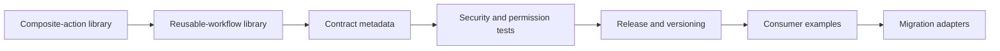

# Relay Architecture

## Purpose and scope

Relay uses a layered, contract-driven architecture. This document owns structural boundaries, dependency direction, integration rules, and current-to-target evolution. Logical responsibilities remain canonical in [SYSTEM.md](SYSTEM.md).

## Layer model

1. **Intent and contracts** — identity, policy, specifications, schemas, and accepted decisions.
2. **Domain** — canonical concepts and pure domain behavior.
3. **Application** — planning, orchestration, use cases, and state transitions.
4. **Adapters** — filesystems, providers, frameworks, renderers, and external tools.
5. **Interfaces** — CLI, library, site, reports, generated artifacts, and automation contracts.
6. **Evidence** — tests, diagnostics, provenance, manifests, and health projections.

Dependencies point inward toward stable contracts and domain behavior. External details do not become canonical domain truth.

## Structural view



The diagram is conceptual. [SYSTEM.md](SYSTEM.md) remains authoritative for responsibilities and implementation evidence determines current availability.

## Implemented v1 package topology

```text
actions/
├── repository-intelligence/      # read-only collector and static renderer
├── normalize-repository-report/  # producer contract adapter
└── publish-report-snapshot/      # guarded default-branch writer

.github/workflows/
├── repository-intelligence.yml   # reusable artifact orchestration
├── validate.yml                  # pull-request and default-branch gate
└── release.yml                   # reviewed manifest or manual SemVer publication

action-catalog.json               # public composite-action surface
workflow-catalog.json             # complete owner, authority, and failure inventory
examples/workflows/               # immutable-pin caller examples
```

The workflow catalog is the machine-readable authority boundary for every
current workflow. It records owner, purpose, audience, permissions, caller
parameters, timeout, concurrency, and failure semantics. CI rejects uncataloged
workflow files and unsafe dependency or trigger forms.

The Repository Intelligence builder never deploys Pages. Consumers compose its
output into their one authoritative site artifact. Relay owns the shared route
shell and static bundle assembly; Observatory owns the normalized public-safe
read model, and Holon owns the framework-neutral visual component vocabulary.
Relay accepts a snapshot only when its repository identity and represented
commit match the generated dashboard. Missing input remains an explicit
unavailable state, and browser-local resume state never becomes canonical
evidence.
The `/roadmap/` composer treats declared roadmap roots as display chapters and
stable roadmap-step identities as durable fragments. It derives only inverse
navigation and exit-criteria presentation from the normalized view: readiness
and provider truth remain Observatory concerns, while `ROADMAP.md` remains the
canonical owner of intent. Long evidence drawers retain complete static HTML
and add browser-only windowing after enhancement.
The tested Observatory and Holon boundaries are pinned in
[`repository-intelligence-siblings.v1.lock.json`](actions/repository-intelligence/contracts/repository-intelligence-siblings.v1.lock.json).

The snapshot publisher is isolated as a
separate action because it requires `contents: write`; all other v1 action jobs
operate with read-only repository permissions.

## Dependency rules

- Sibling domain capabilities integrate through versioned public contracts, not direct access to internals.
- Generated artifacts never become the canonical source unless an accepted decision explicitly changes ownership.
- Provider and platform adapters depend on application ports; core behavior does not depend on a provider implementation.
- Read, plan, apply, verify, publish, and recover remain separate authority boundaries when consequential.
- Cross-repository references use releases, immutable commits, schemas, packages, or documented APIs rather than mutable default-branch assumptions.

## Ecosystem interfaces

- Empathy baseline
- Egolint
- Realm image publishing
- Hygiene policy
- Pace synchronization
- Observatory Repository Intelligence read models
- Holon Repository Intelligence component contracts

## Deployment and portability

The architecture favors independently usable local and self-hosted operation. Optional managed services may add availability, collaboration, support, and hosted infrastructure without becoming the canonical holder of portable state.

## Evidence and uncertainty

- **Observed:** Relay contains machine-readable action and workflow catalogs, three
  independently consumable composite actions, a reusable artifact workflow,
  immutable-pin adoption example, security validation gates, and a
  `release.json`-driven release workflow with verified recovery. Empathy,
  Akashic, and Optiflow have existing Repository Intelligence integrations;
  their migrations remain planned pilots for the hardened package.
- **Decided for this draft:** The repository owns the bounded concern described here and participates through versioned contracts.
- **Proposed:** Target systems and later roadmap phases remain proposals until accepted and implemented.
- **Open question:** Which additional reusable producers should join the repository-wide release unit after v1?
